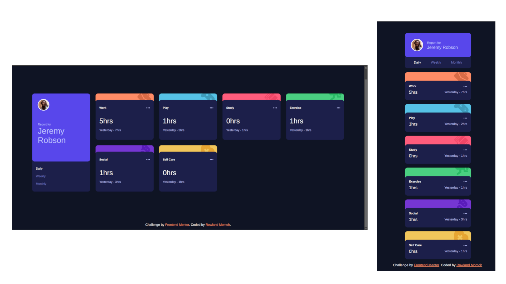

# Frontend Mentor - Time tracking dashboard solution

This is a solution to the [Time tracking dashboard challenge on Frontend Mentor](https://www.frontendmentor.io/challenges/time-tracking-dashboard-UIQ7167Jw). Frontend Mentor challenges help you improve your coding skills by building realistic projects.

## Table of contents

- [Overview](#overview)
  - [The challenge](#the-challenge)
  - [Screenshot](#screenshot)
  - [Links](#links)
- [My process](#my-process)
  - [Built with](#built-with)
  - [What I learned](#what-i-learned)
  - [Continued development](#continued-development)
  - [Useful resources](#useful-resources)
- [Author](#author)
- [Acknowledgments](#acknowledgments)

**Note: Delete this note and update the table of contents based on what sections you keep.**

## Overview

### The challenge

Users should be able to:

- View the optimal layout for the site depending on their device's screen size
- See hover states for all interactive elements on the page
- Switch between viewing Daily, Weekly, and Monthly stats

### Screenshot



### Links

- Solution URL: [Click here](https://your-solution-url.com)
- Live Site URL: [Click here](https://fe-time-tracker.netlify.app/)

## My process

### Built with

- Semantic HTML5 markup
- CSS custom properties
- Flexbox
- CSS Grid
- Mobile-first workflow
- Vanilla JavaScript


### What I learned

I learnt how to better use CSS grid and flexbox together

I also learnt how to apply a different background-color on hover over another element


```css
div.card-info {
    background-color: var(--n-dk-blue);
    border-radius: 10px;
    padding: 1rem;
    position: relative;
    top: -5px;
    z-index: 9;
}

.card-info::after {
    content: '';
    position: absolute;
    inset: 0;
    bottom: -5px;
    background-color: hsla(235, 45%, 61%, 0);
    transition: background-color 0.3s ease;
    cursor: pointer;
    z-index: 1;
    border-radius: 10px;
}

.card-info:hover::after {
    background-color:  hsla(235, 45%, 61%, .3);
}
```

I learnt how to fetch data in JavaScript using the chained promises method and also asychronous functions which I used in this project.

```js
async function getData(time) {
    const res = await fetch('/data.json')
    if(!res.ok) { throw new Error('Failed to fetch data')}
    const data = await res.json()
    renderData(data, time)
}
```

### Continued development

I'll continue to practice to get better with handling data with JavaScript and also implement the DRY concept in coding.

### Useful resources

- [Learn CSS Grid](https://learncssgrid.com/?utm_source=chatgpt.com) - This helped me better understand how to use CSS grid
- [MDN web docs](https://learncssgrid.com/?utm_source=chatgpt.com) - This is an amazing documentation which helped me finally understand the fetch api and how to use it in JavaScript


## Author

- Website - [Rowland Momoh](https://rowland-momoh.netlify.app/://www.your-site.com)
- Frontend Mentor - [@rowleks](https://www.frontendmentor.io/profile/rowleks)
- Twitter - [@Rolexks](https://x.com/Rolexks)


## Acknowledgments

I'm grateful to frontend mentor for this challenge as it helps build my web development skills further. I also thank google, w3school, MDN web docs and other similar sites for their amazing and helpful resources.
